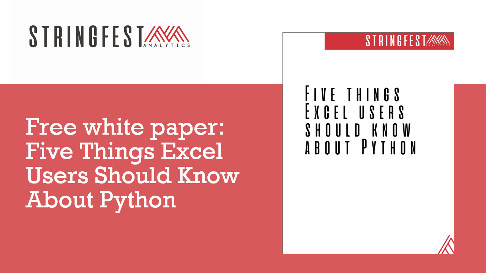
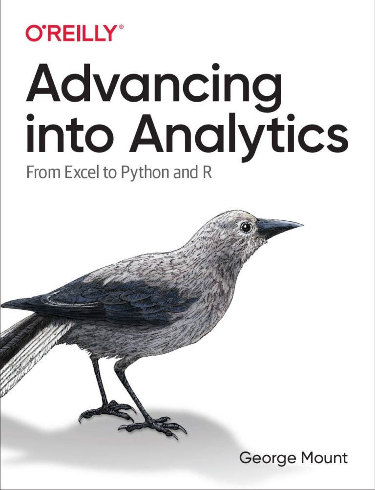

# Five things Excel users should know about Python

Resources for white paper, "Five Things Excel Users Should Know About Python."

To run this repo interactively, click following button: 

To download the accompanying white paper, [subscribe for access](http://georgejmount.com/subscribe/) to my data analytics education resource library. 

If you'd like to learn more about Python and analytics as an Excel user, [check out my book _Advancing into Analytics_](https://georgejmount.com/book/). 

